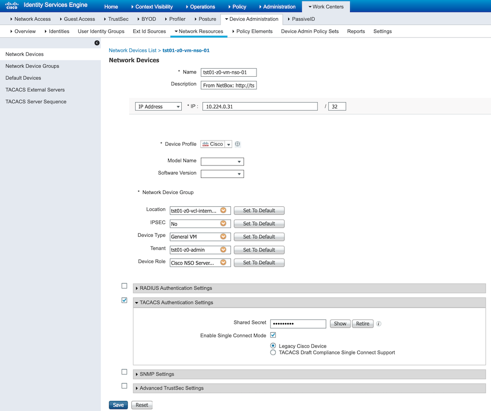
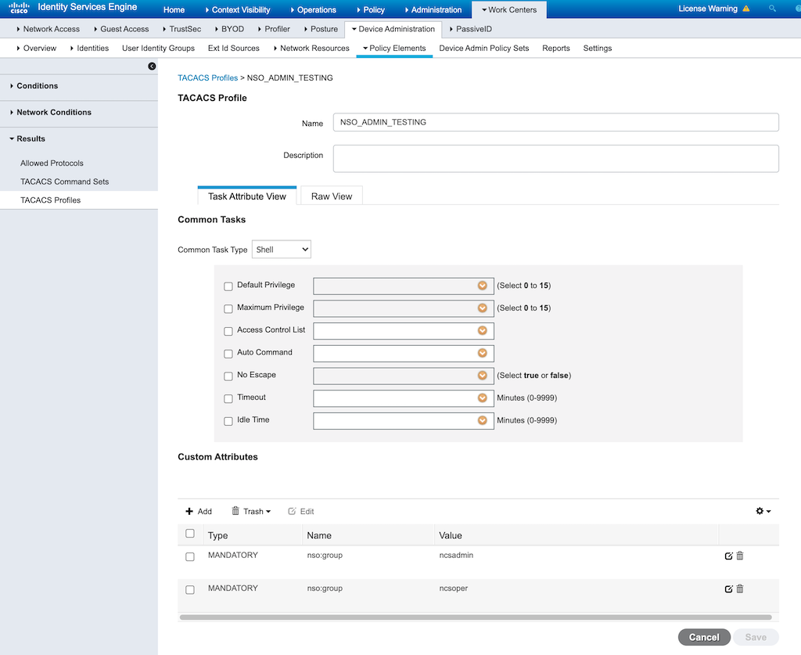
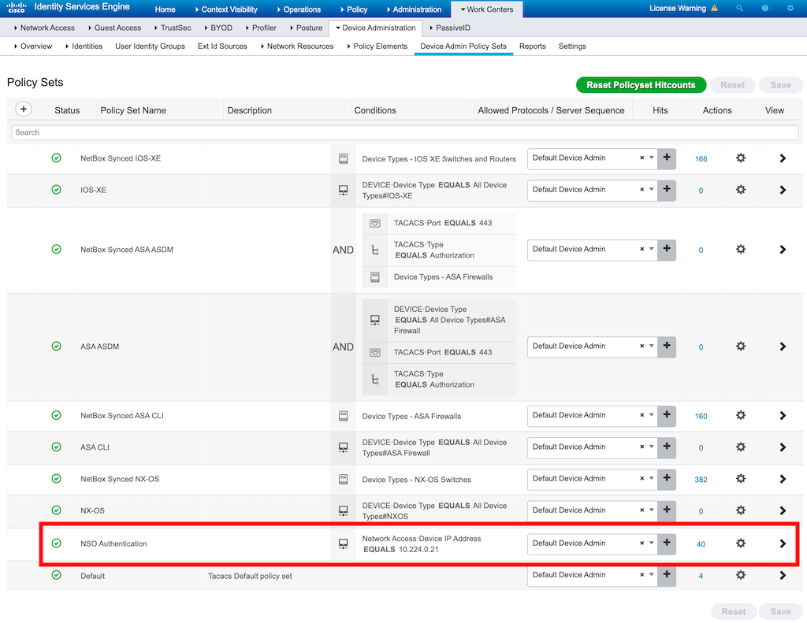
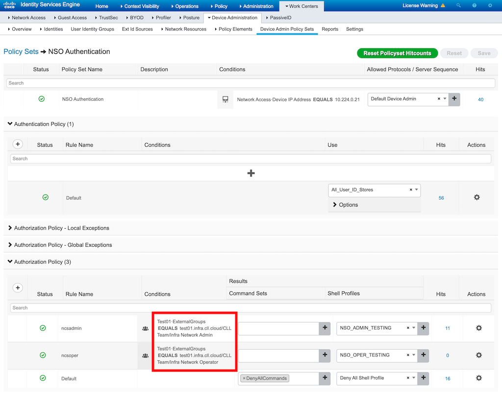

# Preparing TACACS Server - Cisco ISE
Any compliant TACACS server could be used with this integration, however this document is defaulting to Cisco ISE as that is the server used in our architecture.

This document assumes that a functioning TACACS device administration configuration is already in place, servicing network clients (switches, routers, firewalls), and focuses on the configuration specific to adding NSO.  

## Network Device / Resource Setup 
In order for the Python script to successfully communicate with the TACACS server, it neesd to be added to the Network Resources in ISE, enabled for TACACS, and a shared-secret identified. 

## Authentication Setup 
Unless there are unique identity stores and authentication requirements for NSO users, likely there is nothing new needed in ISE to authenticate requests from the NSO script. 

## Authorization Profile
Authorization within NSO is group based, and the script must provide the list of NSO groups that the authenticated user is a member of.  TACACS doesn't natively provide a group list as part of the protocol.  This project leverages the custom attributes that can be passed as arguments within an authorization request/response process to provide a list of group names.  

These are configured as **TACACS Profiles** within Cisco ISE, with custom attributes of name `nso:group` and value of the group name configured.  Any number of `nso:group` attributes can be added to provide multiple groups in a single authorization profile. No other attributes need be configured within the profile (ie Privilege levels). This image shows a profile that passes both the `ncsadmin` and `ncsoper` groups.  

> You will need to create a TACACS Profile for each level of authorization desired.  A minimum configuration would likely be 2 profiles.  One that provides `ncsadmin` group membership and a second the `ncsoper` group.

## Admin Policy Set Creation 
Next you will create a new entry in the **Device Admin Policy Sets** list that will provide the appropriate profile to authorized users.  Here you can see a new entry called **NSO Authentication** has been added to the list following the entries for other device types.  

> You will need to set a condition on the new rule that will match the NSO server(s) that will be sending TACACS requests to the server.  In the image a single server is identified by an IP address, however you can use any attributes for a device when writing this condition.  A "Device Type" of "NSO Server" could be used as an example. 

For the Authentication Policy, use whatever is needed for authentication your users.  Commonly this can be **All_User_ID_Stores** as seen in the image.  

Under Authorization Policy, you'll create a row for each of the Authorization Levels that you need to provide to NSO.  You'll also want to have a final "Deny All" rule for users who successfully Authenticate but do **NOT** pass an explicit Authorization rule above.

In the image you can see that the Authorization rules are tied to conditions of ExternalGroups from the Active Directory users are a member of.  In this way AD Groups are directly tied to NSO RBAC. 

