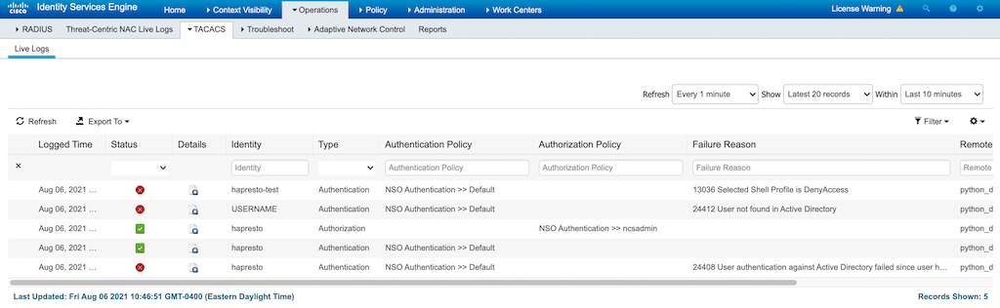

# Troubleshooting External Authentication with Logs
When troubleshooting, or exploring how the authentication process is working, there are three main places to look. 

1. The TACACS server logs - The Cisco ISE Live Log 
1. The user audit log for NSO - `audit.log` 
1. The log for the authentication script itself 

## Checking Cisco ISE Logs
You will troubleshoot failed authentication or authorization from NSO the same way you would troubleshoot a failed TACACS authentication from a network device.  The TACACS Live Logs on Cisco ISE provide details for every request and response sent to/from ISE.  This includes details such as whether a failed authentication was due to: 

* Invalid user
* Invalid password 
* A user was not authorized for access.

Here is an example from the Live Log that shows some different messages. 



Working from the bottom (the oldest message)

1. A valid user (hapresto) failed authentication due to an invalid password 
1. A valid user (hapresto) successfull authenticated. 
1. An authorization request for a user (hapresto) resulted in a policy of "NSO Authentication >> ncsadmin"
1. An authentication request included a user who is NOT found in Active Directory. (The actual username provided is NOT shown or stored in ISE)
1. A user successfully authenticated, but resolved to a default `DenyAccess` policy. This results in a "Failed Authentication" result.

You can view more details on these requests by clicking the "Details" icon.

## Checking NSO `audit.log`
Cisco NSO generates a lot of logs by default.  One of the log files is called `audit.log`.  This file will show the results of successful and unsuccessful logins to the system.  It will also indicate whether a login attempt was processed through local or external authentication. 

Here we see the log files within the NSO logs directory. (Note the path of the log directory maybe different depending on the NSO installation.)

```bash
root@3df80ec44d69:/# ls -l /log/
total 412
-rw-r--r-- 1 root root  91941 Aug  6 14:46 audit.log     <-- The audit log
-rw-r--r-- 1 root root  98273 Aug  5 20:10 devel.log
-rw-r--r-- 1 root root   3025 Aug  5 20:10 ncs-java-vm.log
-rw-r--r-- 1 root root 141820 Aug  6 14:46 ncs-python-extauth-tacacs.log
-rw-r--r-- 1 root root   2247 Aug  5 20:10 ncs-python-vm-tacacs-auth.log
-rw-r--r-- 1 root root   2001 Aug  5 20:10 ncs-python-vm.log
-rw-r--r-- 1 root root  58360 Aug  6 14:13 ncs.log
-rw-r--r-- 1 root root      8 Aug  4 15:13 ncserr.log.1
-rw-r--r-- 1 root root     18 Aug  4 15:13 ncserr.log.idx
-rw-r--r-- 1 root root     13 Aug  4 15:13 ncserr.log.siz
-rw-r--r-- 1 root root      0 Aug  4 15:13 netconf.log
-rw-r--r-- 1 root root      0 Aug  4 15:13 snmp.log
drwxr-xr-x 2 root root      6 Aug  4 15:13 traces
```

If we start a tail on `audit.log` and then attempt to login we can see what details are shown.  

```
tail -f /log/audit.log
```

First, a login attempt with the local `admin` account.  No external authentication required.

```
<INFO> 6-Aug-2021::14:56:31.216 3df80ec44d69 ncs[121]: audit user: admin/0 local authentication succeeded via cli from 10.241.1.1:55032 with ssh, member of groups: ncsadmin
<INFO> 6-Aug-2021::14:56:31.217 3df80ec44d69 ncs[121]: audit user: admin/0 logged in via cli from 10.241.1.1:55032 with ssh using local authentication
<INFO> 6-Aug-2021::14:56:31.219 3df80ec44d69 ncs[121]: audit user: admin/358 assigned to groups: ncsadmin
<INFO> 6-Aug-2021::14:56:31.219 3df80ec44d69 ncs[121]: audit user: admin/358 created new session via cli from 10.241.1.1:55032 with ssh
```

Next, a login attempt with an externally authenticated user.  Notice how first local authentication is attempted and fails.  Then external authentication is tried.  This is an important bit of info.  If a user exists locally, the external authentication won't be tried.

```
<INFO> 6-Aug-2021::14:57:50.875 3df80ec44d69 ncs[121]: audit user: [withheld]/0 local authentication failed via cli from 10.241.1.1:55136 with ssh: no such local user
<INFO> 6-Aug-2021::14:57:51.066 3df80ec44d69 ncs[121]: audit user: hapresto/0 external authentication succeeded via cli from 10.241.1.1:55136 with ssh, member of groups: ncsadmin,ncsoper
<INFO> 6-Aug-2021::14:57:51.066 3df80ec44d69 ncs[121]: audit user: hapresto/0 logged in via cli from 10.241.1.1:55136 with ssh using external authentication
<INFO> 6-Aug-2021::14:57:51.068 3df80ec44d69 ncs[121]: audit user: hapresto/362 assigned to groups: ncsadmin,ncsoper
<INFO> 6-Aug-2021::14:57:51.068 3df80ec44d69 ncs[121]: audit user: hapresto/362 created new session via cli from 10.241.1.1:55136 with ssh
```

And lastly, a failed authentication.  Notice how the username is NOT included in the log.  This is done by NSO for security reasons.  

```
<INFO> 6-Aug-2021::14:59:17.094 3df80ec44d69 ncs[121]: audit user: [withheld]/0 local authentication failed via cli from 10.241.1.1:55266 with ssh: no such local user
<INFO> 6-Aug-2021::14:59:17.244 3df80ec44d69 ncs[121]: audit user: [withheld]/0 external authentication failed via cli from 10.241.1.1:55266 with ssh:  Authentication Failed
<INFO> 6-Aug-2021::14:59:17.244 3df80ec44d69 ncs[121]: audit user: [withheld]/0 login failed via cli from 10.241.1.1:55266 with ssh: noauth
```

## Checking the log for the `tacacs_ext_auth.py` script 
You may have noticed that the `tacacs_ext_auth.py` script has a lot of lines that look like: 

```python
logger.info("Connecting to NSO to retrieve tacacs-auth details")
```

These lines are used to log details about the external authentication process.  Details that don't show up in ISE or in the `audit.log`.  

The configuration for the Python logger is detailed in [`logger.conf`](packages/tacacs-auth/python/tacacs_auth/logger.conf) and use the standard Python logging library.  The key parts of the logging configuration are: 

* Log messages of ERROR or higher are logged to the console 
* All log messages are logged to a file `/log/ncs-python-extauth-tacacs.log` 
    * The goal of this configuration is to log to the same directory where NCS storing other logs.  If you're installation uses a different logging directory it would be good to update this configuration.

If we tail this file, we can see what information is logged there.  

```
tail -f /log/ncs-python-extauth-tacacs.log 
```

First, a successful external authentication 

> Local authentication attemps do NOT run the external auth script at all, and therefore will have no log messages in this file

```
[06/08/2021 15:06:14.431] [INFO] [tacacs_ext_auth.py] [lookup_tacacs_auth_details():46] Connecting to NSO to retrieve tacacs-auth details
[06/08/2021 15:06:14.437] [INFO] [tacacs_ext_auth.py] [lookup_tacacs_auth_details():55] tacacs hosts = ['10.224.0.16']
[06/08/2021 15:06:14.437] [DEBUG] [tacacs_ext_auth.py] [lookup_tacacs_auth_details():56] tacacs secret: secret
[06/08/2021 15:06:14.437] [INFO] [tacacs_ext_auth.py] [<module>():174] Reading credentials from NSO
[06/08/2021 15:06:14.437] [INFO] [tacacs_ext_auth.py] [<module>():177] username=hapresto password=***********
[06/08/2021 15:06:14.438] [INFO] [tacacs_ext_auth.py] [authenticate_user():89] Sending Authentication request to 10.224.0.16 for username hapresto
[06/08/2021 15:06:14.541] [INFO] [tacacs_ext_auth.py] [<module>():186] ✅ Authentication Successful!
[06/08/2021 15:06:14.542] [INFO] [tacacs_ext_auth.py] [authorize_user():111] Sending Authorization request to 10.224.0.16 for username hapresto
[06/08/2021 15:06:14.561] [INFO] [tacacs_ext_auth.py] [<module>():199] ✅ Authorization Successful!
[06/08/2021 15:06:14.562] [INFO] [tacacs_ext_auth.py] [<module>():200] User hapresto authorized for groups ncsadmin, ncsoper
[06/08/2021 15:06:14.562] [INFO] [tacacs_ext_auth.py] [<module>():209] Authentication result: 'accept ncsadmin ncsoper 1004 1004 /tmp'
```

Each step in the external authentication script is configured to log status and results.  You'll find messages about retrieving details from NSO, sending the authentication request, the result, sending the authorization request, the result, and the final overall Authentication result. 

What does a failed authentication look like. 

```
[06/08/2021 15:07:53.354] [INFO] [tacacs_ext_auth.py] [lookup_tacacs_auth_details():46] Connecting to NSO to retrieve tacacs-auth details
[06/08/2021 15:07:53.361] [INFO] [tacacs_ext_auth.py] [lookup_tacacs_auth_details():55] tacacs hosts = ['10.224.0.16']
[06/08/2021 15:07:53.361] [DEBUG] [tacacs_ext_auth.py] [lookup_tacacs_auth_details():56] tacacs secret: secret
[06/08/2021 15:07:53.362] [INFO] [tacacs_ext_auth.py] [<module>():174] Reading credentials from NSO
[06/08/2021 15:07:53.362] [INFO] [tacacs_ext_auth.py] [<module>():177] username=hapresto password=***********
[06/08/2021 15:07:53.362] [INFO] [tacacs_ext_auth.py] [authenticate_user():89] Sending Authentication request to 10.224.0.16 for username hapresto
[06/08/2021 15:07:53.420] [WARNING] [tacacs_ext_auth.py] [<module>():189] ❌🛑 Error: Authentication Failed!
[06/08/2021 15:07:53.421] [WARNING] [tacacs_ext_auth.py] [<module>():202] ❌🛑 Authentication failed, Authorization not performed.
[06/08/2021 15:07:53.421] [WARNING] [tacacs_ext_auth.py] [<module>():203] User hapresto was failed authorization.
[06/08/2021 15:07:53.421] [INFO] [tacacs_ext_auth.py] [<module>():209] Authentication result: 'reject Authentication Failed'
```

The log messages here show that Authentication failed, and Authorization was skipped because of that failure.  The final result is a reject.

What about a case where a TACACS server is down (assuming there are more than one configured.)  This log shows what happens when the first TACACS server tried is unreachable. 

```
[06/08/2021 15:09:34.515] [INFO] [tacacs_ext_auth.py] [lookup_tacacs_auth_details():46] Connecting to NSO to retrieve tacacs-auth details
[06/08/2021 15:09:34.523] [INFO] [tacacs_ext_auth.py] [lookup_tacacs_auth_details():55] tacacs hosts = ['10.224.0.15', '10.224.0.16']
[06/08/2021 15:09:34.523] [DEBUG] [tacacs_ext_auth.py] [lookup_tacacs_auth_details():56] tacacs secret: secret
[06/08/2021 15:09:34.523] [INFO] [tacacs_ext_auth.py] [<module>():174] Reading credentials from NSO
[06/08/2021 15:09:34.523] [INFO] [tacacs_ext_auth.py] [<module>():177] username=hapresto password=***********
[06/08/2021 15:09:34.523] [INFO] [tacacs_ext_auth.py] [authenticate_user():89] Sending Authentication request to 10.224.0.15 for username hapresto
[06/08/2021 15:09:37.530] [WARNING] [tacacs_ext_auth.py] [<module>():189] ❌🛑 Some other error: [Errno 113] No route to host
[06/08/2021 15:09:37.531] [INFO] [tacacs_ext_auth.py] [authenticate_user():89] Sending Authentication request to 10.224.0.16 for username hapresto
[06/08/2021 15:09:37.572] [INFO] [tacacs_ext_auth.py] [<module>():186] ✅ Authentication Successful!
[06/08/2021 15:09:37.572] [INFO] [tacacs_ext_auth.py] [authorize_user():111] Sending Authorization request to 10.224.0.16 for username hapresto
[06/08/2021 15:09:37.593] [INFO] [tacacs_ext_auth.py] [<module>():199] ✅ Authorization Successful!
[06/08/2021 15:09:37.594] [INFO] [tacacs_ext_auth.py] [<module>():200] User hapresto authorized for groups ncsadmin, ncsoper
[06/08/2021 15:09:37.594] [INFO] [tacacs_ext_auth.py] [<module>():209] Authentication result: 'accept ncsadmin ncsoper 1004 1004 /tmp'
```